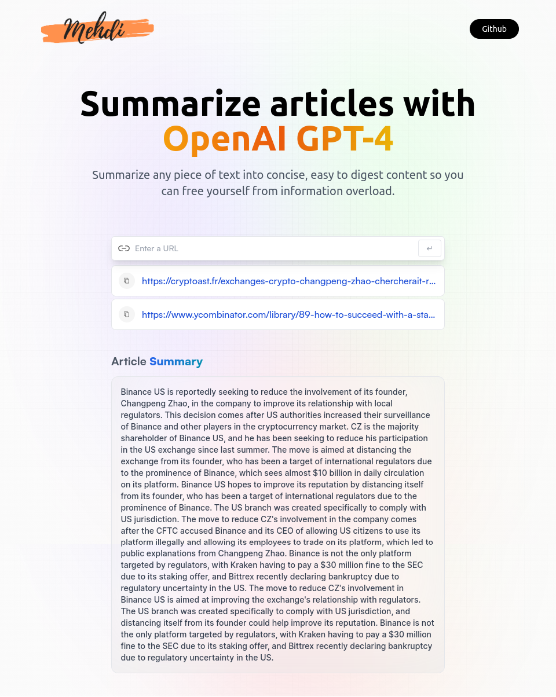

# Mehdi 🤖
tl;dr, short for "too long; didn't read", is internet slang to say that some text being referred to has been ignored because of its length. 
Mehdi is an ai powered tool to summarize of any online post or news article in a click.

[Checkout the demo](https://medhi-a-tldr-tool-318b94.netlify.app/)

this is a basic idea for a SaaS company using OpenAI GPT API

# Next features to add
- [ ]  🔧 **[Soucres](#tech)** - list the tech and the inspirations
- [ ]  💵 **[Monetization](#ads)** - make money from it by branding like a SaaS
- [ ]  🎛 **[Design](#nice)** - two pages : landing page and the app page, writesonic style. 

# Author

Mehdi is developed by [@Naveen](https://github.com/claymeers)